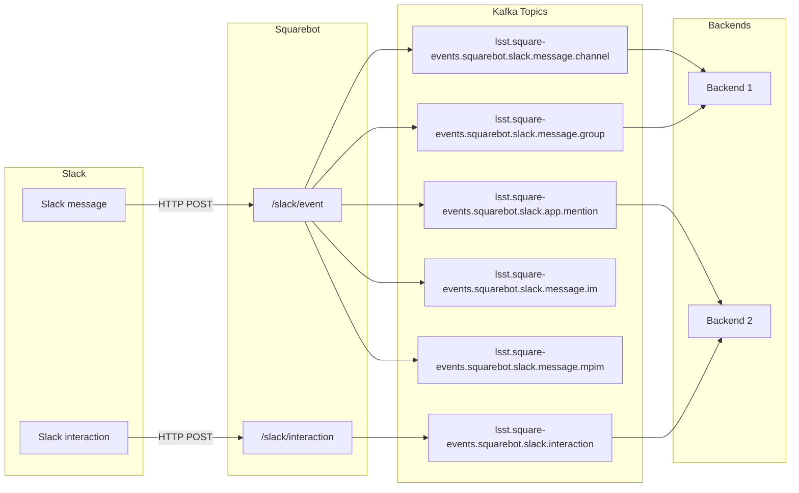

# Squarebot

Squarebot is the nexus service for ChatOps and event-driven bots for Rubin Observatory.
As a Slack app, Squarebot receives events from Slack and publishes them into specific _Square Events_ Kafka topics in the [Roundtable Kubernetes cluster](https://phalanx.lsst.io/environments/roundtable-prod/index.html).
Other applications on Roundtable can consume these events and act on them, such as by posting messages back to Slack or by performing some other background automation.

Slack integration is implemented at the time.
We plan to add support for other event sources, such as GitHub, in the future.

Squarebot is built on top of [FastAPI](https://fastapi.tiangolo.com/), a modern Python web framework, with Rubin/SQuaRE libraries [Safir](https://safir.lsst.io) (FastAPI application libraries) and [Kafkit](https://kafkit.lsst.io) (Kafka integration).
